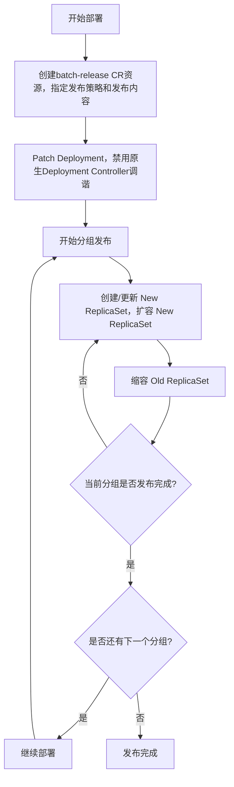

# V1.0.0 - 批次部署

文档变更记录
| 日期 | 版本号 | 修订内容 |修订人
| ---- | ---- | ---- |---- |
| 251026 | V1.0.0 | 创建 | yuyy |

目 录
[TOC]

## 批次部署功能详细设计

### 需求分析

#### 需求描述

k8s原生deployment仅支持滚动更新和重建两种发布模式，对于生产环境，往往需要节奏可控、可灰度、可回滚的发布方式。常见的有批次发布、金丝雀发布、蓝绿发布等策略。本次以批次发布为例，在不改变workload的情况下，对原生deployment增强，从
0 到 1 实现一个部署系统。

#### 业务流程分析

#### 功能性需求描述

1. 批次发布
    1. 取消部署
       1. 不支持，只能发布完成或者回滚
2. 发布期间回滚
3. 发布完成回滚到前1个版本
4. 发布完成回滚到前N个版本
   a. 用户不太清楚前N个版本具体是什么，因此依赖上层应用向用户展示部署历史版本信息，然后直接发布选择的版本
5. 发布时扩缩容

### 功能设计

#### 设计思路

##### CRD

batch-release

**anno**
update-version-raw=podTemplate

**字段**

+ spec
    +   workloadRef:
        apiVersion: apps/v1
        kind: Deployment
        name: workload-demo
    + strategy:
        steps:
        - replicas: 1
        - replicas: 50%
        - replicas: 100%
+ status
    + phase
        + 初始化
        + 发布中
        + pending
        + finalizer
        + 完成
    + 当前分组
    + 分组状态
        + 初始化
        + 滚动更新中
        + 暂停
        + 更新完成
    + Replicas
    + ObservedReplicas

##### 批次发布

+ 创建/更新 batchRelease CR
    + 查询CR是否存在（上层应用做的）
        + 如果存在，检查状态是否为完成
            + 不是完成状态，返回错误
            + 是完成状态，更新 CR
        + 不存在，创建CR
    + 设置 podTemplate
    + 设置分组比例
+ 进入batchRelease状态机
    + 初始化
        + 初始化status
        + 获取deployment的部署策略，记录到deployment的anno batch-release.rollouts.yuyy.com/deployment-strategy
          + 不需要
        + Patch Deployment
          + podTemplate
          + anno batch-release.rollouts.yuyy.com/control-info
            + {
              "apiVersion": "rollouts.kruise.io/v1beta1",
              "kind": "BatchRelease",
              "name": "my-batchrelease"
              }
          + 设置为recreate模式
          + pause=true
          + label batch-release.rollouts.yuyy.com/controlled-by-batch-release-controller
            + 暂时不加，用的时候再加
    + 发布中
        + 根据MaxUnavailable判断是否能继续发布
          + 校验失败时，进入pending状态
          + 如何区分暂时达到MaxUnavailable，和一直卡在MaxUnavailable？
            + 如何判断容器启动失败？有超时时间吗？
        + 进入分组状态机
            + 初始化
            + 滚动更新中
                + 根据MaxSurge判断可以更新的pod数量
                + 创建/更新 New ReplicaSet
                  + 更新deployment状态
                + 已经ready的pod数量大于replicas，缩容old replicaset 多余的pod数量
                  + 更新deployment状态
                + 新旧replicaset达到当前分组的partition，分组进入暂停状态
            + 暂停
              + 如果是最后一个分组，直接进入完成状态
              + 更新deployment状态
            + 更新完成
              + 当前分组是否为最后一分组
                + 不是，当前分组+1，分组状态置为初始化
                + 是
                  + 更新deployment状态
                  + batchRelease的状态改为finalizer
    + pending
      + 校验 MaxUnavailable，通过时，进入发布中状态
    + finalizer
      + 还原deployment的部署策略和pause字段
      + 删除deployment的anno batch-release.rollouts.yuyy.com/deployment-strategy
      + 删除deployment的label batch-release.rollouts.yuyy.com/controlled-by-batch-release-controller
      + 删除anno batch-release.rollouts.yuyy.com/control-info
      + 进入到完成状态
    + 完成
+ 继续发布
  + 更新分组状态，暂停改为完成
##### 发布期间回滚

##### 发布时扩缩容

